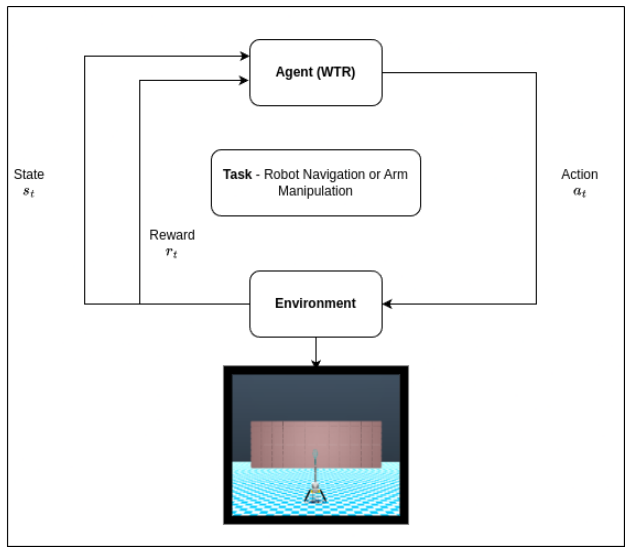
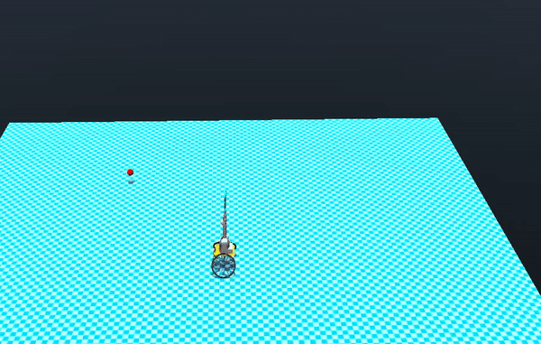
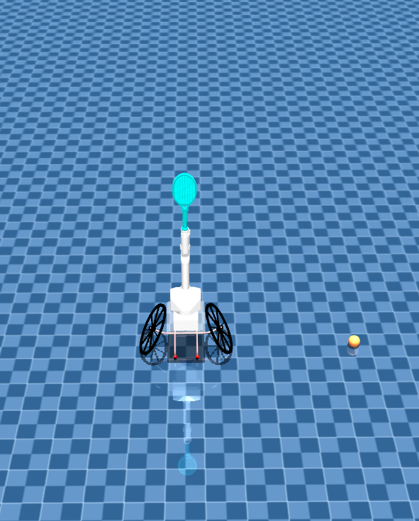
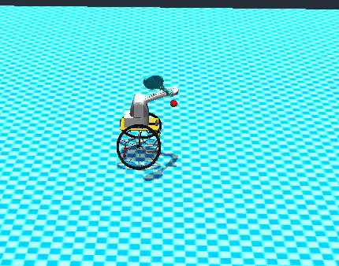
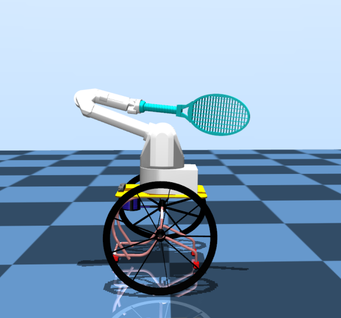

# Sim-to-real transfer of RL policies for ESTHER
[ESTHER](https://arxiv.org/abs/2210.02517) utilizes commercially available off-the-shelf
hardware and is designed with portability in mind and the setup
consists of a 7-DOF Barret WAM serial arm equipped with
a tennis racket, which is mounted on a regulation Top End
Pro Tennis Wheelchair. This works aims at developing RL policies for the robot to navigate the tennis court effectively and plan strokes appropriately. Our key contributions can be summarized as follows: 

- Develop a fully functioning physics simulator (MuJoCo) for safe & efficient design of control policies using RL based on Soft Actor-Critic [(SAC)](https://arxiv.org/abs/1812.05905).
- Integrate the learned policy on the ESTHER and validate
performance.

<br>
 

## Installation 
Make sure you have conda installed in your system before proceeeding. Use the following command to create a new conda environment to run the below scripts. 
```
conda env create -f env.yaml
conda activate wtr
```

## Overview
<p>
We currently provide support for four environments and the instructions to execute them are organized as follows: 

- [Navigation Task](#1-navigation-task)
- [Reach Task](#2-reach-task) 


</p>


## Environments
### 1. Navigation Task <br>

#### Description
In this experiment, the objective
is to teach the ESTHER to navigate to an arbitrarily sampled goal position $(x,y)$ in a constrained 2-D plane while respecting the controller dynamics. The environment, which is a **16 x 16** space consisting of the robot and a goal position spawned at random at the end of every episode. Episodes will be terminated if the robot goes out of bounds or if the total time steps, $t_{max}$ have elapsed.


<br>
  

#### Usage 
Check out the `scripts/navigaterobot_v2.py` to get started with the environment details i.e, rewards and the observation space. Support for logging using `wandb` is provided along with the `tensorboard`. For starters, you can train the environment by: 

```
cd /scripts
python train_navigator.py --env blockreacher
```

<br>

### 2. Reach Task <br>

#### Description
The objective is to enable the WAM arm on the ESTHER to reach an arbitrarily placed 3-D goal position within the robot’s work envelope without navigating the robot. Ideally, the policy learned should reflect
the inverse kinematic mapping from joint accelerations to
joint torques. Similar to the previous task, episodes will be terminated if the time steps, $t_{max}$ have elapsed.


<br>
  

#### Usage 
Check out the `scripts/armreacher_v1.py` to get started with the environment details i.e, rewards and the observation space. Support for logging using `wandb` is provided along with the `tensorboard`. For starters, you can train the environment by: 

```
cd /scripts
python train_armreacher.py
```


